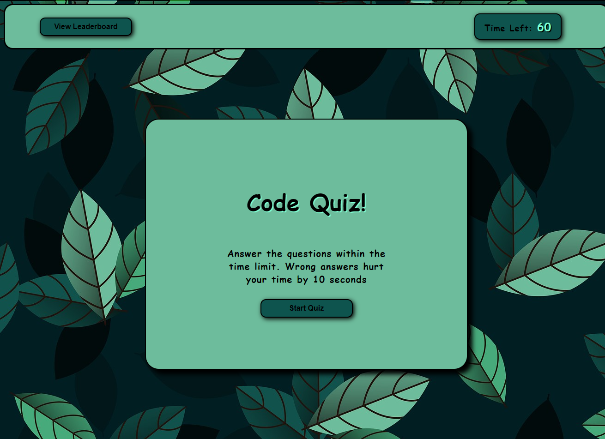

    
# Code Quiz

## Contents
  1. [About](#about)
      1. [User Story](#user%20story)
      2. [Acceptance criteria](#acceptance%20criteria)
      3. [Visuals](#visuals)
      4. [Build](#build)
  2. [Installation](#installation)
  3. [License](#license)
  4. [Contributing](#contributing)
  5. [Tests](#tests)
  6. [Authors and acknowledgment](#authors%20and%20acknowledgment)
---
## About
 ### This is a simple code quiz used to test your knowledge in basic javaScript and HTML. Wrong answers effect your time by 10 seconds and you'll be able to save your score to the leaderboard
---
## Usage Info
  ### Open the page and hit Start Quiz!
---
## Installation:
  Click the link below to go to the repository and clone the project

  To clone the repo:
  
      git clone git@github.com:Mpergolatti/code-quiz.git
  
---
## License:

  Licensed under the [MIT](https://opensource.org/licenses/MIT) license.

  * For more information on license types, please reference this website
  for additional licensing information - [https: //choosealicense.com/](https://choosealicense.com/).
---
## Contributing:
  
  To contribute to this application, create a pull request.
  Here are the steps needed for doing that:
  - Fork the repo
  - Create a feature branch (git checkout -b NAME-HERE)
  - Commit your new feature (git commit -m 'Add some feature')
  - Push your branch (git push)
  - Create a new Pull Request
  Following a code review, your feature will be merged.

  Additional info below:

  Message me for contribution information
---
## Tests:
  Tested and Passed

---
## Screenshots:

  
---
## Questions and Comments:
* GitHub Username: Mpergolatti
* GitHub Email: Mpergolatti@gmail.com

